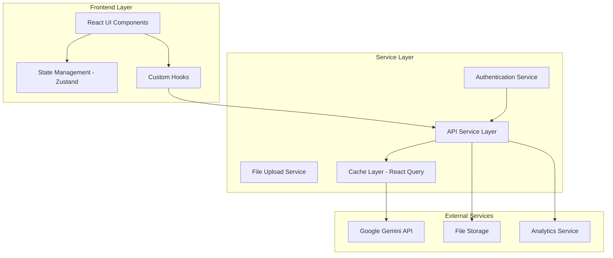
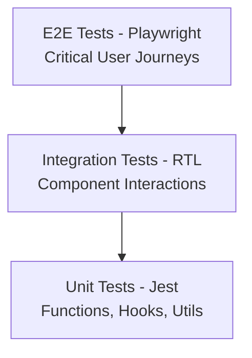

# Design Document

## Overview

This design document outlines the transformation of the Product In-Situ Placer application into a production-ready system following enterprise-grade architecture patterns, security best practices, and modern development standards. The design emphasizes scalability, maintainability, performance, and developer experience while preserving the core functionality of AI-powered product image placement.

## Architecture

### High-Level Architecture



### Folder Structure

```
src/
├── components/           # Reusable UI components (Atomic Design)
│   ├── atoms/           # Basic building blocks
│   ├── molecules/       # Simple component combinations
│   ├── organisms/       # Complex component combinations
│   └── templates/       # Page-level layouts
├── features/            # Feature-based modules
│   ├── auth/           # Authentication feature
│   ├── image-upload/   # Image upload feature
│   ├── image-generation/ # AI generation feature
│   └── user-profile/   # User management feature
├── hooks/              # Custom React hooks
├── services/           # API and external service integrations
├── store/              # State management
├── types/              # TypeScript type definitions
├── utils/              # Utility functions and helpers
├── constants/          # Application constants
├── styles/             # Global styles and theme
├── assets/             # Static assets
└── __tests__/          # Test files
```

## Components and Interfaces

### Component Architecture (Atomic Design)

#### Atoms

- `Button` - Reusable button with variants
- `Input` - Form input with validation
- `Icon` - SVG icon wrapper
- `Spinner` - Loading indicator
- `Avatar` - User avatar component
- `Badge` - Status indicators

#### Molecules

- `FormField` - Input with label and error
- `ImagePreview` - Image thumbnail with actions
- `ProgressBar` - Upload/generation progress
- `ErrorMessage` - Styled error display
- `SearchBox` - Search input with icon

#### Organisms

- `ImageUploader` - Complete upload interface
- `ImageGallery` - Grid of uploaded images
- `GenerationPanel` - AI generation controls
- `NavigationBar` - Main navigation
- `UserMenu` - User account dropdown

#### Templates

- `AuthLayout` - Authentication pages layout
- `AppLayout` - Main application layout
- `ModalLayout` - Modal container template

### State Management Architecture

```typescript
// Store structure using Zustand
interface AppStore {
  // Auth state
  auth: {
    user: User | null;
    isAuthenticated: boolean;
    isLoading: boolean;
  };

  // Image management state
  images: {
    uploaded: UploadedImage[];
    generated: GeneratedImage[];
    isUploading: boolean;
    isGenerating: boolean;
  };

  // UI state
  ui: {
    theme: 'light' | 'dark';
    sidebarOpen: boolean;
    activeModal: string | null;
  };

  // Actions
  actions: {
    auth: AuthActions;
    images: ImageActions;
    ui: UIActions;
  };
}
```

### API Service Layer

```typescript
// Base API client with interceptors
class ApiClient {
  private client: AxiosInstance;

  constructor() {
    this.client = axios.create({
      baseURL: process.env.REACT_APP_API_BASE_URL,
      timeout: 30000,
    });

    this.setupInterceptors();
  }

  private setupInterceptors() {
    // Request interceptor for auth tokens
    // Response interceptor for error handling
    // Retry logic for failed requests
  }
}

// Feature-specific services
interface ImageService {
  uploadImages(files: File[]): Promise<UploadResponse>;
  generateInSitu(params: GenerationParams): Promise<GenerationResponse>;
  getHistory(): Promise<ImageHistory[]>;
}

interface AuthService {
  login(credentials: LoginCredentials): Promise<AuthResponse>;
  register(userData: RegisterData): Promise<AuthResponse>;
  refreshToken(): Promise<TokenResponse>;
  logout(): Promise<void>;
}
```

## Data Models

### Core Data Types

```typescript
// User management
interface User {
  id: string;
  email: string;
  name: string;
  avatar?: string;
  subscription: SubscriptionTier;
  createdAt: Date;
  lastLoginAt: Date;
}

// Image handling
interface UploadedImage {
  id: string;
  file: File;
  preview: string;
  uploadProgress: number;
  status: 'uploading' | 'uploaded' | 'error';
  metadata: ImageMetadata;
}

interface GeneratedImage {
  id: string;
  originalImages: string[];
  prompt: string;
  result: string;
  status: 'generating' | 'completed' | 'failed';
  createdAt: Date;
  metadata: GenerationMetadata;
}

// API responses
interface ApiResponse<T> {
  data: T;
  success: boolean;
  message?: string;
  errors?: ValidationError[];
}

// Error handling
interface AppError {
  code: string;
  message: string;
  details?: Record<string, any>;
  timestamp: Date;
}
```

### Validation Schemas

```typescript
// Using Zod for runtime validation
const uploadImageSchema = z.object({
  file: z
    .instanceof(File)
    .refine(file => file.size <= 10 * 1024 * 1024, 'File too large')
    .refine(
      file => ['image/jpeg', 'image/png', 'image/webp'].includes(file.type),
      'Invalid file type'
    ),
});

const generationPromptSchema = z.object({
  prompt: z
    .string()
    .min(10, 'Prompt too short')
    .max(500, 'Prompt too long')
    .refine(text => !containsProfanity(text), 'Inappropriate content'),
  style: z.enum(['realistic', 'artistic', 'minimal']),
  quality: z.enum(['standard', 'high', 'ultra']),
});
```

## Error Handling

### Error Boundary Implementation

```typescript
class AppErrorBoundary extends Component<Props, State> {
  constructor(props: Props) {
    super(props);
    this.state = { hasError: false, error: null };
  }

  static getDerivedStateFromError(error: Error): State {
    return { hasError: true, error };
  }

  componentDidCatch(error: Error, errorInfo: ErrorInfo) {
    // Log to monitoring service
    errorReportingService.captureException(error, {
      extra: errorInfo,
      tags: { component: 'ErrorBoundary' },
    });
  }
}
```

### API Error Handling Strategy

```typescript
// Centralized error handling
class ErrorHandler {
  static handle(error: unknown): AppError {
    if (axios.isAxiosError(error)) {
      return this.handleApiError(error);
    }

    if (error instanceof ValidationError) {
      return this.handleValidationError(error);
    }

    return this.handleUnknownError(error);
  }

  private static handleApiError(error: AxiosError): AppError {
    const status = error.response?.status;

    switch (status) {
      case 401:
        return new AppError('AUTH_REQUIRED', 'Please log in to continue');
      case 403:
        return new AppError(
          'INSUFFICIENT_PERMISSIONS',
          "You don't have permission for this action"
        );
      case 429:
        return new AppError(
          'RATE_LIMITED',
          'Too many requests. Please try again later'
        );
      default:
        return new AppError(
          'API_ERROR',
          'Something went wrong. Please try again'
        );
    }
  }
}
```

### Retry Logic

```typescript
// Exponential backoff retry mechanism
const retryConfig = {
  retries: 3,
  retryDelay: (retryCount: number) => Math.pow(2, retryCount) * 1000,
  retryCondition: (error: AxiosError) => {
    return error.response?.status === 429 || error.response?.status >= 500;
  },
};
```

## Testing Strategy

### Testing Pyramid



### Test Organization

```typescript
// Component testing pattern
describe('ImageUploader', () => {
  describe('File Upload', () => {
    it('should accept valid image files', async () => {
      // Arrange
      const mockFile = new File([''], 'test.jpg', { type: 'image/jpeg' });
      const onUpload = jest.fn();

      // Act
      render(<ImageUploader onUpload={onUpload} />);
      const input = screen.getByLabelText(/upload/i);
      await user.upload(input, mockFile);

      // Assert
      expect(onUpload).toHaveBeenCalledWith([mockFile]);
    });

    it('should reject files that are too large', async () => {
      // Test implementation
    });
  });
});

// Hook testing pattern
describe('useImageGeneration', () => {
  it('should handle generation lifecycle', async () => {
    const { result } = renderHook(() => useImageGeneration());

    act(() => {
      result.current.generate(mockImages, mockPrompt);
    });

    expect(result.current.isGenerating).toBe(true);

    await waitFor(() => {
      expect(result.current.isGenerating).toBe(false);
    });
  });
});
```

### Mock Strategy

```typescript
// API mocking with MSW
const handlers = [
  rest.post('/api/images/generate', (req, res, ctx) => {
    return res(
      ctx.delay(2000), // Simulate network delay
      ctx.json({
        success: true,
        data: { imageUrl: 'mock-generated-image.jpg' },
      })
    );
  }),

  rest.post('/api/auth/login', (req, res, ctx) => {
    const { email, password } = req.body;

    if (email === 'test@example.com' && password === 'password') {
      return res(ctx.json({ token: 'mock-jwt-token' }));
    }

    return res(ctx.status(401), ctx.json({ error: 'Invalid credentials' }));
  }),
];
```

## Security Implementation

### Input Validation and Sanitization

```typescript
// File upload security
class FileValidator {
  static validateImage(file: File): ValidationResult {
    // Check file size
    if (file.size > MAX_FILE_SIZE) {
      throw new ValidationError('File too large');
    }

    // Check MIME type
    if (!ALLOWED_MIME_TYPES.includes(file.type)) {
      throw new ValidationError('Invalid file type');
    }

    // Check file signature (magic bytes)
    return this.validateFileSignature(file);
  }

  private static async validateFileSignature(file: File): Promise<boolean> {
    const buffer = await file.arrayBuffer();
    const bytes = new Uint8Array(buffer.slice(0, 4));

    // Check for valid image signatures
    const signatures = {
      jpeg: [0xff, 0xd8, 0xff],
      png: [0x89, 0x50, 0x4e, 0x47],
      webp: [0x52, 0x49, 0x46, 0x46],
    };

    return Object.values(signatures).some(sig =>
      sig.every((byte, i) => bytes[i] === byte)
    );
  }
}
```

### Content Security Policy

```typescript
// CSP configuration
const cspConfig = {
  'default-src': ["'self'"],
  'script-src': ["'self'", "'unsafe-inline'", 'https://apis.google.com'],
  'style-src': ["'self'", "'unsafe-inline'", 'https://fonts.googleapis.com'],
  'img-src': ["'self'", 'data:', 'https:'],
  'connect-src': ["'self'", 'https://generativelanguage.googleapis.com'],
  'font-src': ["'self'", 'https://fonts.gstatic.com'],
};
```

### Authentication Security

```typescript
// JWT token management
class TokenManager {
  private static readonly TOKEN_KEY = 'auth_token';
  private static readonly REFRESH_KEY = 'refresh_token';

  static setTokens(accessToken: string, refreshToken: string): void {
    // Store in httpOnly cookies for security
    document.cookie = `${this.TOKEN_KEY}=${accessToken}; Secure; SameSite=Strict`;
    document.cookie = `${this.REFRESH_KEY}=${refreshToken}; Secure; SameSite=Strict`;
  }

  static clearTokens(): void {
    document.cookie = `${this.TOKEN_KEY}=; expires=Thu, 01 Jan 1970 00:00:00 UTC; path=/;`;
    document.cookie = `${this.REFRESH_KEY}=; expires=Thu, 01 Jan 1970 00:00:00 UTC; path=/;`;
  }
}
```

## Performance Optimization

### Code Splitting Strategy

```typescript
// Route-based code splitting
const AuthPages = lazy(() => import('../features/auth/AuthPages'));
const Dashboard = lazy(() => import('../features/dashboard/Dashboard'));
const ImageGeneration = lazy(
  () => import('../features/image-generation/ImageGeneration')
);

// Component-based splitting for heavy components
const ImageEditor = lazy(() => import('../components/organisms/ImageEditor'));
```

### Image Optimization

```typescript
// Image compression before upload
class ImageOptimizer {
  static async compressImage(file: File, quality: number = 0.8): Promise<File> {
    return new Promise(resolve => {
      const canvas = document.createElement('canvas');
      const ctx = canvas.getContext('2d')!;
      const img = new Image();

      img.onload = () => {
        // Calculate optimal dimensions
        const { width, height } = this.calculateDimensions(
          img.width,
          img.height
        );

        canvas.width = width;
        canvas.height = height;

        // Draw and compress
        ctx.drawImage(img, 0, 0, width, height);
        canvas.toBlob(resolve, 'image/jpeg', quality);
      };

      img.src = URL.createObjectURL(file);
    });
  }
}
```

### Caching Strategy

```typescript
// React Query configuration
const queryClient = new QueryClient({
  defaultOptions: {
    queries: {
      staleTime: 5 * 60 * 1000, // 5 minutes
      cacheTime: 10 * 60 * 1000, // 10 minutes
      retry: (failureCount, error) => {
        if (error.status === 404) return false;
        return failureCount < 3;
      },
    },
  },
});

// Service worker for offline caching
const cacheStrategy = {
  images: 'CacheFirst',
  api: 'NetworkFirst',
  static: 'StaleWhileRevalidate',
};
```

## Deployment Architecture

### Docker Configuration

```dockerfile
# Multi-stage build for optimization
FROM node:18-alpine AS builder
WORKDIR /app
COPY package*.json ./
RUN npm ci --only=production

COPY . .
RUN npm run build

FROM nginx:alpine AS production
COPY --from=builder /app/dist /usr/share/nginx/html
COPY nginx.conf /etc/nginx/nginx.conf
EXPOSE 80
CMD ["nginx", "-g", "daemon off;"]
```

### CI/CD Pipeline

```yaml
# GitHub Actions workflow
name: Deploy to Production
on:
  push:
    branches: [main]

jobs:
  test:
    runs-on: ubuntu-latest
    steps:
      - uses: actions/checkout@v3
      - uses: actions/setup-node@v3
      - run: npm ci
      - run: npm run lint
      - run: npm run test:coverage
      - run: npm run build

  deploy:
    needs: test
    runs-on: ubuntu-latest
    steps:
      - name: Deploy to staging
        run: |
          # Deployment commands
      - name: Run E2E tests
        run: npm run test:e2e
      - name: Deploy to production
        if: success()
        run: |
          # Production deployment
```

### Environment Configuration

```typescript
// Environment-specific configurations
interface EnvironmentConfig {
  apiBaseUrl: string;
  geminiApiKey: string;
  analyticsId: string;
  logLevel: 'debug' | 'info' | 'warn' | 'error';
  features: {
    analytics: boolean;
    errorReporting: boolean;
    performanceMonitoring: boolean;
  };
}

const configs: Record<string, EnvironmentConfig> = {
  development: {
    apiBaseUrl: 'http://localhost:3001',
    logLevel: 'debug',
    features: {
      analytics: false,
      errorReporting: false,
      performanceMonitoring: false,
    },
  },
  production: {
    apiBaseUrl: 'https://api.productplacer.com',
    logLevel: 'error',
    features: {
      analytics: true,
      errorReporting: true,
      performanceMonitoring: true,
    },
  },
};
```

This design provides a comprehensive foundation for transforming the application into a production-ready system while maintaining its core functionality and improving scalability, security, and maintainability.
